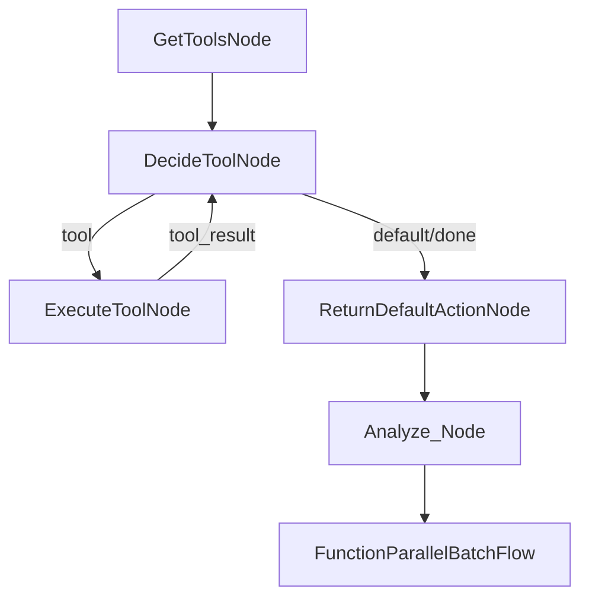
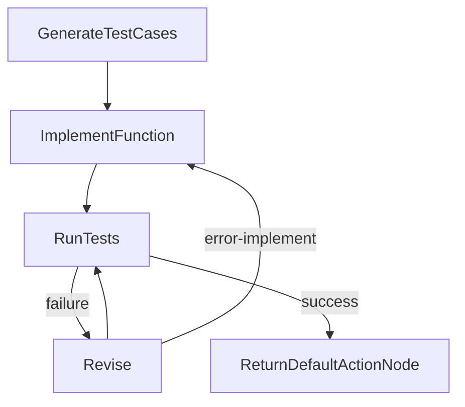

# PocketFlow Code Generator

A modular, agentic, and async-first framework for automated code understanding, test generation, and validation. This project leverages LLMs and tool APIs to analyze code, generate tests, implement functions, and validate results in a fully automated pipeline.

## Features
- **Agentic Tool Use**: Uses LLMs to decide which tools to invoke for file discovery and reading.
- **Automated Function Extraction**: Extracts functions from code for targeted testing.
- **Test Generation & Execution**: Generates test cases, implements test code, and runs tests in parallel.
- **Iterative Revision**: Automatically revises code and tests on failure, with retries and error handling.
- **Async & Batch Processing**: Scales to multiple functions/files using async and batch flows.

## Main Flow



- **GetToolsNode**: Discovers available tools (e.g., file readers) via MCP server.
- **DecideToolNode**: LLM decides which tool to use and with what parameters.
- **ExecuteToolNode**: Executes the chosen tool and stores results.
- **ReturnDefaultActionNode**: Handles default/done actions.
- **Analyze_Node**: Extracts functions from the file for testing.
- **FunctionParallelBatchFlow**: For each function, runs the subflow below.

## Run Test Subflow



- **GenerateTestCases**: LLM generates test cases for each function.
- **ImplementFunction**: LLM writes test code for each function.
- **RunTests**: Executes tests (async/parallel).
- **Revise**: If tests fail, LLM revises code/tests and retries.
- **ReturnDefaultActionNode**: Handles successful completion.

## Quickstart

1. **Install dependencies**
   ```bash
   pip install -r requirements.txt
   ```
2. **Set environment variables** (for tool access, e.g., `ALLOW_READ_FILE_PATH`)
3. **Run the main script**
   ```bash
   python main.py
   ```

## File Structure

- `main.py` — Entry point, runs the main async flow
- `flow.py` — Defines the main flow and batch/parallel subflows
- `nodes/` — Node implementations (tool use, analysis, test generation, etc.)
- `utils/` — Utility functions (LLM calls, tool wrappers, file ops)
- `myPocketFlow/` — Minimalist async/agentic flow framework

## Design Highlights
- **Agentic**: LLM-driven tool selection and action planning
- **Async/Batched**: Handles multiple functions/files in parallel
- **Extensible**: Add new tools, nodes, or flows easily
- **Separation of Concerns**: Each node does one thing; flows orchestrate

---

For more, see `flow.py`, `nodes/`, and the `docs/` directory.
