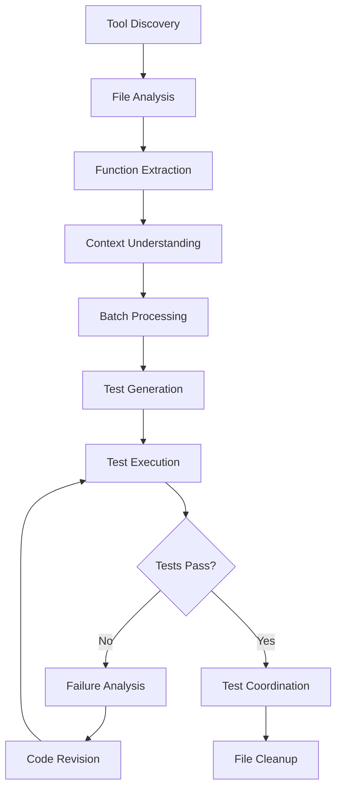
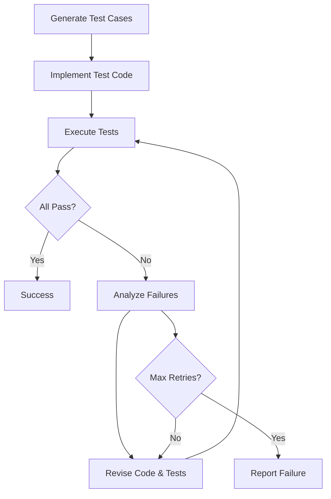

# Test Creator - AI-Powered Test Generation System

[](https://github.com/your-repo)
[](https://nodejs.org/)
[](https://python.org/)

A sophisticated, AI-powered test generation system that automatically analyzes JavaScript code, generates comprehensive test cases, and validates implementation through iterative refinement. Built on the PocketFlow framework with async-first architecture.

## ✨ Key Features

### 🤖 **AI-Driven Automation**
- **Intelligent Function Analysis**: Automatically extracts and understands function purpose and behavior
- **Context-Aware Test Generation**: Creates comprehensive test cases based on function semantics
- **Adaptive Revision**: Self-improving system that learns from test failures

### ⚡ **High-Performance Architecture**
- **Async & Parallel Processing**: Handles multiple functions simultaneously
- **Batch Operations**: Scales efficiently for large codebases
- **Memory Optimized**: Smart resource management for large files

### 🔧 **Robust Test Pipeline**
- **Multi-LLM Support**: Works with OpenAI, Anthropic, XAI, and more
- **Automatic Retry Logic**: Configurable retry mechanisms with exponential backoff
- **Test Execution**: Real Jest test runner integration
- **Failure Analysis**: Intelligent analysis of test failures with automatic fixes

## 🚀 Quick Start

### Prerequisites
```bash
# Node.js 18+ for test execution
node --version

# Python 3.8+ for the main system
python --version
```

### Installation
```bash
# Clone and setup
git clone <your-repo-url>
cd test-creater

# Install Python dependencies
pip install -r requirements.txt

# Install Node.js dependencies for test execution
npm install
```

### Configuration
```bash
# Copy environment template
cp .env.example .env

# Add your API keys
export OPENAI_API_KEY="your-openai-key"
export ANTHROPIC_API_KEY="your-anthropic-key"  # optional
```

### Usage
```bash
# Run the test generator
python main.py

# The system will:
# 1. Discover and read your JavaScript files
# 2. Extract functions for testing
# 3. Generate comprehensive test cases
# 4. Create and execute tests
# 5. Iteratively improve failed tests
```

## 📋 Current Project Status

**Overall Progress: 87% Complete (13/15 tasks)**

### ✅ Completed Features
- [x] Project Repository Setup
- [x] Tool Discovery System (MCP Integration)
- [x] Multi-LLM Integration (OpenAI, Anthropic, XAI, Gemini)
- [x] Function Extraction & Analysis
- [x] Context Understanding & Purpose Analysis
- [x] Dependency Mapping Between Functions
- [x] AI-Powered Test Case Generation
- [x] Automated Test Implementation
- [x] Async Test Execution System
- [x] Intelligent Failure Analysis
- [x] Automatic Code Revision
- [x] Retry Mechanisms with Exponential Backoff
- [x] Batch Processing for Multiple Functions

### 🚧 In Progress
- [ ] **Large Codebase Optimization** (Current Focus)
  - [ ] Memory Profiling Analysis
  - [ ] Caching Strategy Implementation
  - [ ] Performance Benchmarking
  - [ ] Resource Usage Optimization
  - [ ] Documentation & Performance Testing
- [ ] CI/CD Pipeline Integration

## 🏗️ Architecture Overview

### Main Processing Flow


### Test Generation Subflow


## 📂 Project Structure

```
test-creater/
├── main.py                 # Application entry point
├── flow.py                 # Main workflow orchestration
├── config/                 # Configuration management
│   ├── actions.py         # Action constants
│   ├── shared_keys.py     # Shared data keys
│   └── system_config.py   # System configuration
├── nodes/                  # Processing nodes
│   ├── base/              # Base node implementations
│   ├── test/              # Test-specific nodes
│   │   ├── analysis.py    # Function analysis
│   │   ├── generation.py  # Test case generation
│   │   ├── execution.py   # Test execution
│   │   ├── revision.py    # Code revision
│   │   └── fileCoordinator.py # File coordination
│   ├── tool/              # Tool integration nodes
│   ├── formatters/        # Prompt formatting
│   └── response_parser/   # LLM response parsing
├── utils/                  # Utility functions
│   ├── call_llm/          # Multi-LLM support
│   ├── code_executor.py   # Test execution engine
│   └── file_utils.py      # File operations
├── myPocketFlow/          # Custom async flow framework
└── test/                  # Generated test files
    ├── *.test.js          # Generated test suites
    └── *_copy.js          # Implementation suggestions
```

## 🔧 Configuration

### Environment Variables
```bash
# Required: At least one LLM provider
OPENAI_API_KEY="sk-..."              # OpenAI GPT models
ANTHROPIC_API_KEY="sk-ant-..."       # Claude models  
XAI_API_KEY="xai-..."               # Grok models
GOOGLE_API_KEY="..."                # Gemini models

# Optional: System configuration
ALLOW_READ_FILE_PATH="/path/to/code" # Allowed file paths
MCP_SERVER_PATH="mcp_server.py"      # MCP server location
```

### System Configuration
Key settings in `config/system_config.py`:
- `MAX_ITERATION`: Maximum retry attempts per test suite
- `SYSTEM_MAX_LOOP`: Maximum system-level retry loops
- `TEST_DIRECTORY`: Output directory for generated tests
- `BORDER`: Console output formatting

## 🧪 Example Output

When you run the system on a JavaScript file like `myMath.js`:

```javascript
// Input: myMath.js
function add(a, b) { return a + b; }
function div(a, b) { return a / b; }
```

**Generated Output:**
- `test/_20250621_abc123.myMath.test.js` - Comprehensive test suite
- `test/myMath_copy.js` - Improved implementation (if needed)

**Test Results:**
```
🎯 Testing function: add
✅ Passed: 8/8 tests

🎯 Testing function: div  
❌ Failed: 2/6 tests
💭 AI review the test result for div...
🔄 Revising implementation...
✅ Passed: 6/6 tests (after revision)
```

## 🚀 Advanced Usage

### Custom LLM Configuration
```python
# In utils/call_llm/
# Add your own LLM provider by implementing the call_llm function
async def call_llm(prompt, model="gpt-4"):
    # Your implementation
    pass
```

### Extending Node Functionality
```python
# Create custom nodes by inheriting from base classes
from myPocketFlow import AsyncNode

class CustomAnalysisNode(AsyncNode):
    async def exec_async(self, prep_res):
        # Your custom logic
        return result
```

## 🤝 Contributing

1. Fork the repository
2. Create a feature branch (`git checkout -b feature/amazing-feature`)
3. Commit your changes (`git commit -m 'Add amazing feature'`)
4. Push to the branch (`git push origin feature/amazing-feature`)
5. Open a Pull Request

## 📄 License

This project is licensed under the MIT License - see the [LICENSE](LICENSE) file for details.

## 🙏 Acknowledgments

- Built on the [PocketFlow](https://github.com/the-pocket/PocketFlow) framework
- Inspired by modern AI-driven development tools
- Thanks to the open-source community for LLM integrations

---

**Need Help?** Check out the `docs/` directory or open an issue!
